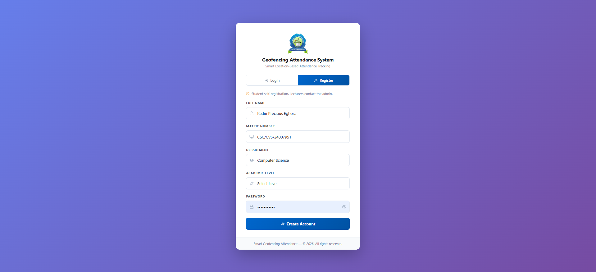
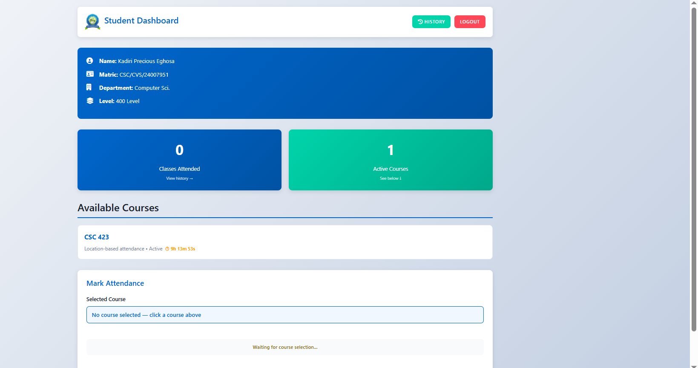
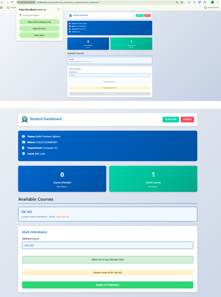
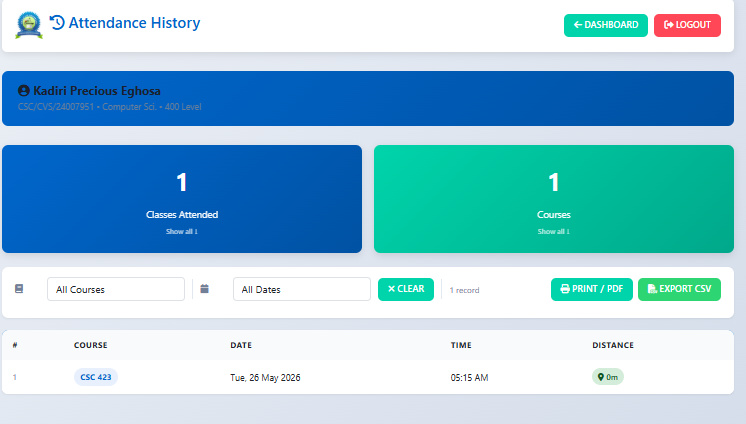
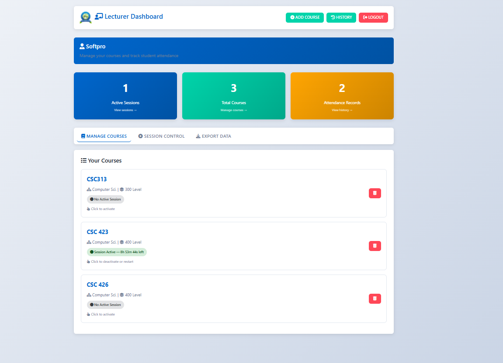
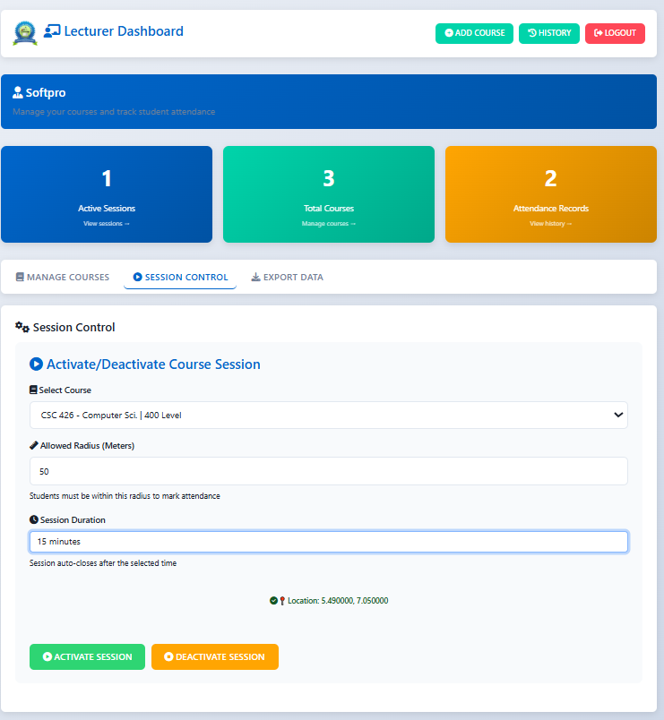
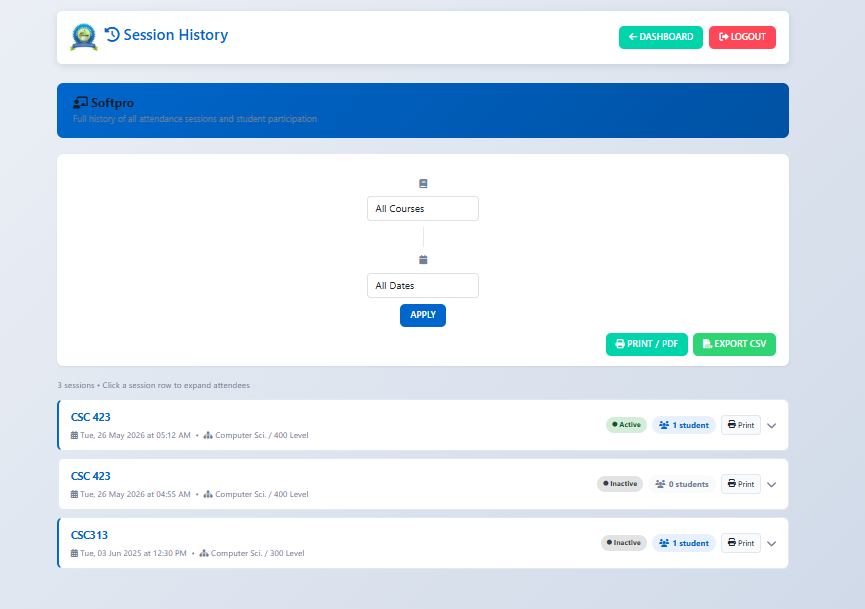
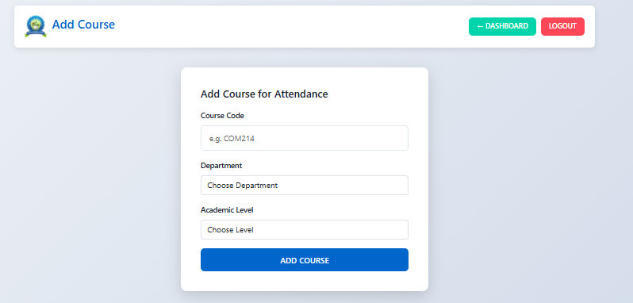

# Smart Geofencing Attendance System

A location-based attendance tracking system built with PHP and MySQL. Students can only mark attendance when their device is physically within a configurable radius of the classroom. Lecturers control sessions in real time from their dashboard.

---

## Table of Contents

- [Features](#features)
- [Tech Stack](#tech-stack)
- [Project Structure](#project-structure)
- [Database Schema](#database-schema)
- [Installation](#installation)
- [Configuration](#configuration)
- [Usage](#usage)
- [How Geofencing Works](#how-geofencing-works)
- [URL Structure](#url-structure)
- [Security](#security)

---

## Features

**Student**
- Self-registration with department and academic level
- Dashboard showing classes attended and active courses
- Location-checked attendance marking — blocked if too far from class
- Live countdown timer showing how long a session remains open
- Full attendance history with course and date filtering
- CSV export and print-to-PDF of personal history

**Lecturer**
- Login via admin-registered account
- Add and delete courses (delete cascades to all attendance data)
- Activate a session directly from the course card — sets classroom GPS coordinates, allowed radius, and optional auto-close timer
- Live countdown on the dashboard showing time remaining for active sessions
- Session history with per-session attendee lists
- Export history to CSV, print individual session reports

**System**
- Extensionless URLs via Apache mod_rewrite (`.htaccess`)
- Auto-redirect to dashboard if already logged in
- Sessions auto-expire on the server and in the browser simultaneously
- Duplicate attendance prevention per student and per IP/device

---

## Screenshots

| Login | Register |
|---|---|
|  |  |

| Student Dashboard | Marking Attendance |
|---|---|
|  |  |

| Attendance Success | Student History |
|---|---|
|  |  |

| Lecturer Dashboard | Course Modal |
|---|---|
|  |  |

| Session History | Add Course |
|---|---|
|  |  |

---

## Tech Stack

| Layer | Technology |
|---|---|
| Backend | PHP 8.2 |
| Database | MySQL 5.7+ |
| Server | Apache (XAMPP) |
| Frontend | Bootstrap 5, Font Awesome 6 |
| Alerts | SweetAlert2 |
| Maps | Leaflet.js |
| JS Utilities | jQuery 3 |

---

## Project Structure

```
geofencing_attendance_system/
│
├── index.php                  # Login + student registration
├── student_dashboard.php      # Student home — mark attendance
├── student_history.php        # Student attendance history
├── lecturer_dashboard.php     # Lecturer home — manage courses & sessions
├── lecturer_history.php       # Lecturer session history
├── lecturer_register.php      # Lecturer self-registration page
├── add_courses.php            # Add a new course
├── print_session.php          # Printable single-session report
├── style.css                  # Shared stylesheet
├── .htaccess                  # Extensionless URL rewriting
│
├── backend/
│   ├── db.php                 # Database connection
│   ├── unified_login.php      # Handles student + lecturer login (JSON)
│   ├── register.php           # Student registration (JSON)
│   ├── logout.php             # Student session destroy
│   ├── admin_logout.php       # Lecturer session destroy
│   ├── activate_course.php    # Activate / deactivate attendance session
│   ├── check_distance.php     # Returns session coords + expiry (JSON)
│   ├── mark_attendance.php    # Saves attendance record
│   ├── delete_course.php      # Deletes course + all its data
│   ├── export_attendance.php  # XLS export (legacy per-course)
│   ├── export_student_history.php  # CSV export for student
│   └── export_lecturer_history.php # CSV export for lecturer
│
├── assets/
│   ├── css/
│   │   ├── bootstrap.min.css
│   │   └── all.min.css        # Font Awesome
│   ├── js/
│   │   ├── jquery.min.js
│   │   └── bootstrap.bundle.min.js
│   └── img/
│       └── logo.png
│
└── plugins/
    └── sweetalerts/
        ├── sweetalert2.min.css
        └── sweetalert2.min.js
```

---

## Database Schema

Run the following SQL in phpMyAdmin (or any MySQL client) to create the required tables.

```sql
CREATE DATABASE IF NOT EXISTS geofencing_attendance;
USE geofencing_attendance;

CREATE TABLE students (
    matric_number VARCHAR(50)  PRIMARY KEY,
    name          VARCHAR(100) NOT NULL,
    department    VARCHAR(100) NOT NULL,
    level         VARCHAR(10)  NOT NULL,
    password      VARCHAR(255) NOT NULL
);

CREATE TABLE lecturers (
    id       INT          AUTO_INCREMENT PRIMARY KEY,
    username VARCHAR(100) NOT NULL UNIQUE,
    password VARCHAR(255) NOT NULL
);

CREATE TABLE courses (
    id          INT         AUTO_INCREMENT PRIMARY KEY,
    course_code VARCHAR(50) NOT NULL,
    lecturer_id INT         NOT NULL,
    department  VARCHAR(100) NOT NULL,
    level       VARCHAR(10)  NOT NULL,
    FOREIGN KEY (lecturer_id) REFERENCES lecturers(id) ON DELETE CASCADE
);

CREATE TABLE attendance_sessions (
    id           INT          AUTO_INCREMENT PRIMARY KEY,
    course_code  VARCHAR(50)  NOT NULL,
    lecturer_id  INT          NOT NULL,
    status       ENUM('active','inactive') DEFAULT 'inactive',
    expected_lat DOUBLE       NOT NULL DEFAULT 0,
    expected_lng DOUBLE       NOT NULL DEFAULT 0,
    accuracy     FLOAT        DEFAULT 0,
    department   VARCHAR(100) NOT NULL,
    level        VARCHAR(10)  NOT NULL,
    radius       INT          DEFAULT 50,
    started_at   DATETIME     DEFAULT CURRENT_TIMESTAMP,
    expires_at   DATETIME     NULL DEFAULT NULL,
    FOREIGN KEY (lecturer_id) REFERENCES lecturers(id)
);

CREATE TABLE attendance (
    id            INT          AUTO_INCREMENT PRIMARY KEY,
    matric_number VARCHAR(50)  NOT NULL,
    course_code   VARCHAR(50)  NOT NULL,
    session_id    INT          NOT NULL,
    timestamp     DATETIME     DEFAULT CURRENT_TIMESTAMP,
    latitude      DOUBLE       NOT NULL,
    longitude     DOUBLE       NOT NULL,
    accuracy      FLOAT        DEFAULT 0,
    device        VARCHAR(250),
    ip_address    VARCHAR(45),
    distance      DOUBLE       DEFAULT 0,
    FOREIGN KEY (matric_number) REFERENCES students(matric_number),
    FOREIGN KEY (session_id)    REFERENCES attendance_sessions(id)
);
```

---

## Installation

### Prerequisites

- [XAMPP](https://www.apachefriends.org/) (PHP 8.2+, MySQL 5.7+, Apache)
- A modern browser with Geolocation support (Chrome, Firefox, Edge)
- Git (optional, for cloning)

### Steps

**1. Clone or download the project**

```bash
git clone https://github.com/YOUR_USERNAME/geofencing_attendance_system.git
```

Place the folder inside `C:\xampp\htdocs\project\` so the full path is:
```
C:\xampp\htdocs\project\geofencing_attendance_system\
```

**2. Start XAMPP**

Open the XAMPP Control Panel and start both **Apache** and **MySQL**.

**3. Create the database**

- Open [http://localhost/phpmyadmin](http://localhost/phpmyadmin)
- Click **New**, name the database `geofencing_attendance`, click **Create**
- Select the new database, go to the **SQL** tab
- Paste and run the SQL from the [Database Schema](#database-schema) section above

**4. Configure the database connection**

Open `backend/db.php` and update if your credentials differ:

```php
$host = "localhost";
$user = "root";
$pass = "";                      // XAMPP default has no password
$db   = "geofencing_attendance";
```

**5. Enable mod_rewrite (for extensionless URLs)**

Open `C:\xampp\apache\conf\httpd.conf`, find the block for `htdocs` and ensure `AllowOverride All` is set:

```apacheconf
<Directory "C:/xampp/htdocs">
    AllowOverride All
    ...
</Directory>
```

Restart Apache after saving.

**6. Open the app**

Visit [http://localhost/project/geofencing_attendance_system](http://localhost/project/geofencing_attendance_system)

---

## Configuration

### Adding a Lecturer Account

Lecturers are registered via the **Lecturer Register** page:

```
http://localhost/project/geofencing_attendance_system/lecturer_register
```

### Geolocation on localhost

Browsers block Geolocation on non-HTTPS pages unless the origin is `localhost`. The app works on `localhost` out of the box. For a live server, HTTPS is required.

---

## Usage

See the full guides for each role:

- [Student User Guide](docs/STUDENT_GUIDE.md)
- [Lecturer User Guide](docs/LECTURER_GUIDE.md)

---

## How Geofencing Works

When a student selects a course, the browser calls `backend/check_distance` which returns the session's GPS coordinates and allowed radius. The browser then requests the student's current position via the **Geolocation API** and calculates the straight-line distance using the **Haversine formula**:

```
d = 2R * arcsin( sqrt( sin²(Δlat/2) + cos(lat1)*cos(lat2)*sin²(Δlng/2) ) )
```

The student can only submit attendance if:

```
distance <= radius + (student_accuracy + lecturer_accuracy + 50m buffer)
```

The 50-metre buffer accounts for GPS drift. The same check is repeated server-side in `backend/mark_attendance.php` before the record is saved, so the client-side check cannot be bypassed.

---

## URL Structure

All `.php` extensions are hidden via Apache mod_rewrite. The actual files still use `.php` on disk.

| URL | Page |
|---|---|
| `/project/geofencing_attendance_system/` | Login / Register |
| `/…/student_dashboard` | Student dashboard |
| `/…/student_history` | Student history |
| `/…/lecturer_dashboard` | Lecturer dashboard |
| `/…/lecturer_history` | Lecturer session history |
| `/…/lecturer_register` | Lecturer registration |
| `/…/add_courses` | Add course |
| `/…/print_session?id=N` | Printable session report |

---

## Security

| Threat | Mitigation |
|---|---|
| SQL injection | All queries use MySQLi prepared statements |
| Session hijacking | PHP sessions with auth guards on every page |
| Distance spoofing | Distance validated server-side before saving |
| Duplicate marking | Checked by both matric number and IP address per session |
| Unauthorised export | Auth guard on all backend export scripts |
| XSS | All output passed through `htmlspecialchars()` |
| CSRF (basic) | Session ownership verified before any write operation |

---

## License

MIT License — free to use, modify, and distribute with attribution.
